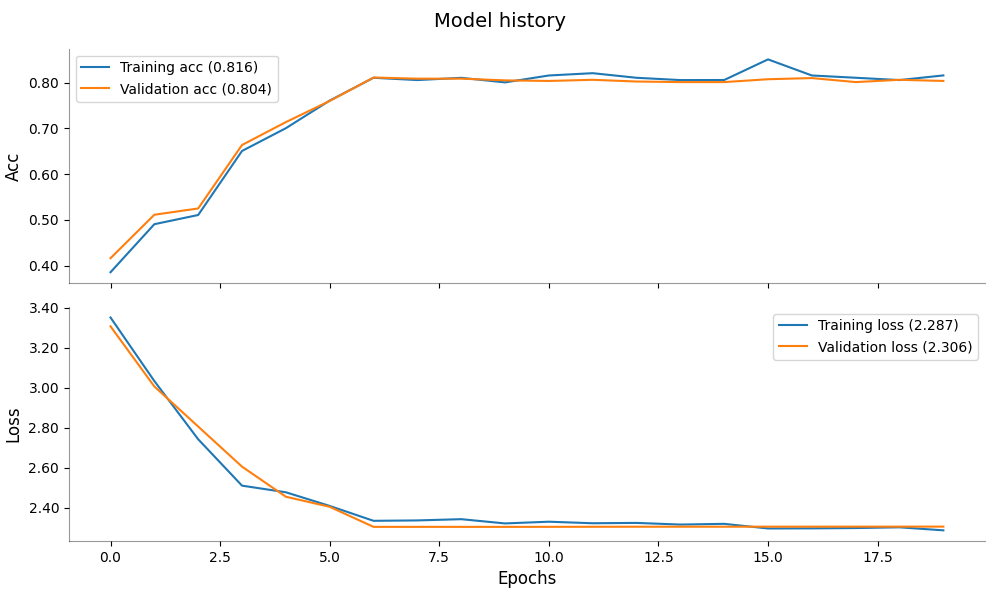
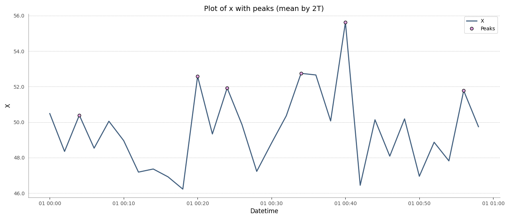

.. bff documentation master file, created by
   sphinx-quickstart on Thu Jun 27 21:58:58 2019.
   You can adapt this file completely to your liking, but it should at least
   contain the root `toctree` directive.

bff
===

*Best Fancy Functions, your Best Friend Forever*

The bff package contains some utility functions from plots to data manipulations and could become your new bff.

The goal of this package is to have easy access of the functions I am using frequently on projects.

.. |true_vs_pred| image:: ../../tests/baseline/test_plot_true_vs_pred_default.png
   :width: 30%
   :align: middle
   :alt: True vs prediction

|history_with_metric| |series_peaks| |true_vs_pred|

This is still a work in progress, contributions are welcome.

.. toctree::
   :maxdepth: 2
   :caption: Getting Started

   quickstart

.. toctree::
   :maxdepth: 2
   :caption: User Guide

   fancy

   config

